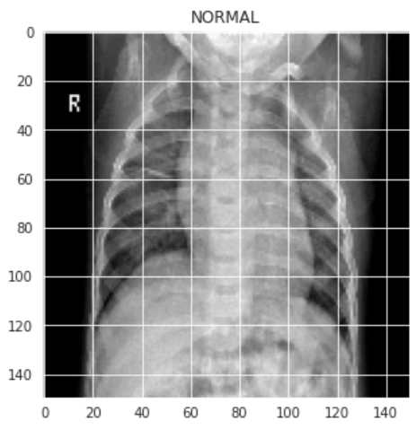
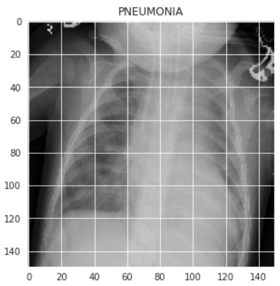
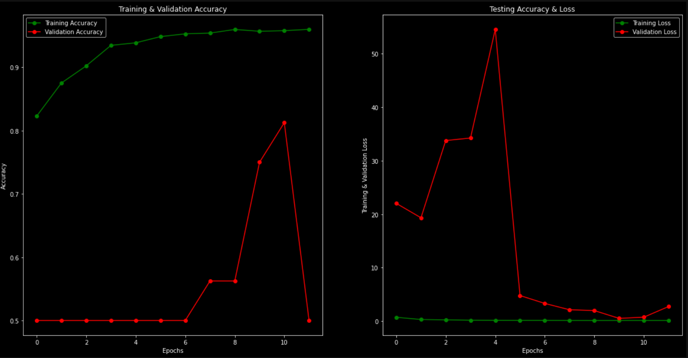

# Pneumonia Detection

A neural network (CNN) that can detect wether a patient has pneumonia or not.
For the data I used: https://www.kaggle.com/datasets/paultimothymooney/chest-xray-pneumonia. 
The Chest X-ray images (anterior-posterior) were selected from retrospective cohorts of pediatric patients of one to five years old from Guangzhou Women and Children’s Medical Center, Guangzhou. All chest X-ray imaging was performed as part of patients’ routine clinical care.

Here is an example of a patient with and without pneumonia:
<p align="center">
   
</p>

<p align="center">
   
</p>


## Libraries

- Python 3.7 or later
- Numpy
- Seaborn
- Matplotlib
- Pandas
- Keras
- Cv2

## Model
For the model I used a Covolutional Neural Network (CNN). 
Convolutional neural networks are distinguished from other neural networks by their superior performance with image, speech, or audio signal inputs. They have three main types of layers, which are:

- Convolutional layer
- Pooling layer
- Fully-connected (FC) layer

The convolutional layer is the first layer of a convolutional network. While convolutional layers can be followed by additional convolutional layers or pooling layers, the fully-connected layer is the final layer. With each layer, the CNN increases in its complexity, identifying greater portions of the image. Earlier layers focus on simple features, such as colors and edges. As the image data progresses through the layers of the CNN, it starts to recognize larger elements or shapes of the object until it finally identifies the intended object.

You can learn more about it here: https://en.wikipedia.org/wiki/Convolutional_neural_network

## Results

After training the model we plot the accuaracy and loss of the training, testing and validation data:

<p align="center">
   
</p>


## Installation

Clone the repository to your local machine:

```bash
 git clone https://github.com/NicolasCort/Sentimental-tweets.git

```
Install the required packages using pip:

```bash
 pip install -r requirements.txt


```


